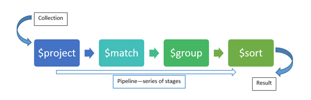

# 6장 집계 프레임워크

## 집계 프레임워크 개요 (6.1 집계 프레임워크 개요)



기존에 맵-리듀스를 통해 뽑아내던 데이터를 집계 프레임워크를 이용해 쉽게 뽑아낼 수 있다.

### 파이프라인이란

> 컴퓨터 과학에서 파이프라인(영어: pipeline)은 한 데이터 처리 단계의 출력이 다음 단계의 입력으로 이어지는 형태로 연결된 구조를 가리킨다. 이렇게 연결된 데이터 처리 단계는 한 여러 단계가 서로 동시에, 또는 병렬적으로 수행될 수 있어 효율성의 향상을 꾀할 수 있다. 각 단계 사이의 입출력을 중계하기 위해 버퍼가 사용될 수 있다.

출처 : [위키백과](https://ko.wikipedia.org/wiki/%ED%8C%8C%EC%9D%B4%ED%94%84%EB%9D%BC%EC%9D%B8_(%EC%BB%B4%ED%93%A8%ED%8C%85))

#### 예시
``ps -ef | grep java``
`|` 파이프라인 기호 앞의 `ps -ef` 출력이 `grep` 의 입력으로 이어지는 형태

### 집계 파이프라인 연산자 (요약)
* `$project` – select, reshape data (sql - SELECT, * -> 출력 필드 명시)
* `$match` – filter data (sql - WHERE)
* `$group` – aggregate data (sql - GROUP BY)
* `$sort` – sorts data (sql - ORDER BY)
* `$skip` – skips data (sql - OFFSET)
* `$limit` – limit data (sql - LIMIT)
* `$unwind` – normalizes data (sql - JOIN?)
* `$convert` - document 필드 타입 변경하는 연산자 (from 4.x)

비슷한 것 - [과일 선별기 유튜브 영상](https://www.youtube.com/embed/_OGiqCw-J_U?start=28)

### 집계 파이프라인 동작

```javascript
db.products.aggregate([
  {$match: {}}, // 1
  {$group: {}}, // 2
  {$sort: {}} // 3
]);
```

aggregate 에 파라미터로 전달된 배열의 순서대로 동작(1 > 2 > 3) 후 최종 결과가 반환된다.

#### 생각해볼 점
* 연산자 순서가 변경되면 어떤 영향을 줄 수 있을까?
    - match > group 순서가 group > match 로 변경되면 ?

## 집계 파이프라인 스테이지 연산자 (6.3 집계 파이프라인 연산자)

책에는 자주 사용되는 10개 소개, 현재 4.4 기준으로 약 20여개의 연산자가 있다. 참고, [Aggregation Pipeline Stages](https://docs.mongodb.com/manual/reference/operator/aggregation-pipeline/#aggregation-pipeline-stages)

제약 사항이 있는데, `$out`, `$merge`, `$geoNear` 연산자는 파이프라인에서 여러번 사용할 수 없다. 나머지는 다 여러번 사용이 가능하다.

## 집계 파이프라인 식 연산자 (6.4 도큐먼트 재구성)


1. 문자열 함수
2. 산술 함수
3. 날짜/시간 함수
4. 논리 함수
5. 집합 함수

## 집계 파이프라인 성능에 대한 이해

1. 파이프라인에서 도큐먼트 수와 크기를 줄인다. ($project, $match)
2. 인덱스를 이용해 작업을 가속화 할 수 있다. ($match, $sort)
3. $match 또는 $sort 이외의 연산자를 파이프라인에서 사용한 후에는 인덱스를 사용할 수 없다.
4. 샤딩을 사용하는 경우 $match 및 $project 연산자는 개별 샤드에서 실행된다. 다른 연산자의 경우 남아있는 파이프라인이 프라이머리 샤드에서 실행된다.

### 집계 파이프라인 옵션

* explain (sql - EXPLAIN) - 파이프라인을 실행하고 파이프라인 프로세스 세부 정보만 반환
* allowDiskUse - 중간 결과를 위해 디스크를 사용
* cursor - 초기 배치 크기를 지정

```javascript
db.collection.aggregate([
  // 집계 파이프라인
], {
  explain: true,
  allowDiskUse: true,
  cursor: {
    batchSize: n
  }
})
```

#### explain
1. find, findOne 의 explain 메서드
* 어떤 인덱스를 사용하는지
* 어떤 도큐먼트를 반환, 스캔하는지

2. aggregate 의 explain 옵션
* 인덱스가 사용되었는지
* 인덱스가 범위 내에서 스캔되었는지

#### allowDiskUse
파이프라인의 출력이 다음 단계의 입력으로 전달될 때, 메모리를 사용하는데 이 메모리 사용량의 제한은 100MB

allowDiskUse 옵션을 사용하면 disk 까지 사용하여 도큐먼트 크기에 관계 없이 실행할 수 있다. 하지만, 메모리와 디스크의 성능 차이로 속도가 느려질 수 있다.

#### cursor
* 커서는 쿼리의 결과를 반환하는 객체
* 한 번에 출력 도큐먼트 중 일부에만 액세스하는 동안 큰 결과 세트를 처리할 수 있으므로 한 번에 처리되는 결과를 포함하는 데 필요한 메모리가 줄어든다
* 커서를 이용하면 도큐먼트를 한 번에 

## 기타 집계 기능

* `.count()` 와 `.distinct()` 간단한 메서드로도 제공

### 맵리듀스

* 자바스크립트를 사용할 수 있어 유연하다.
* 집계 프레임워크보다 느리다.
* 직관적이지 않다.

집계 프레임워크가 생기면서 사용하지 않는 것이 좋을 것 같아보인다. [MongoDB showdown: Aggregate vs map-reduce.](https://sysdig.com/blog/mongodb-showdown-aggregate-vs-map-reduce/#:~:text=Map%2Dreduce%20is%20a%20common,promises%20to%20be%20much%20faster.)


## 참고자료
* https://www.codeproject.com/Articles/1149682/Aggregation-in-MongoDB
* https://github.com/mongodb/mongo/tree/master/src/mongo/shell
